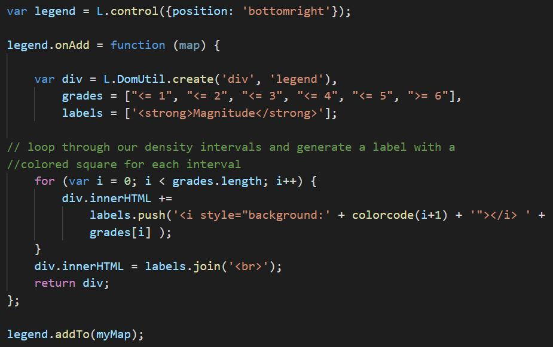

Using the Earthquake dataset provided from <a href="https://earthquake.usgs.gov/earthquakes/feed/v1.0/summary/all_day.geojson">USGS </a>, the data comes in the form of geojson and is then presented to the HTML file via Javascript using D3.json()  
The dataset includes data such as magnitude of the quakes, time it happened, longitude, latitude. 
Theres are required to plot the circles on the map.

The second set of data contains <a href="https://github.com/fraxen/tectonicplates">tectonic plates coordinates</a> which are in JSON format.  
The map is initialised using map provided by <a href="https://www.mapbox.com/">MapBox</a>.
Two main maps are selected for this project - Street and Satellite view.  
A conditional for the color code to differentiate the magnitudes of each quakes that are happening 

 

 
The following is the snippet of code to create circles for the quakes and appending them onto the map
 

As for the tectonic data, lines are being plotted on the map.

 

The base and overlay Maps are then set for the Layer Controls. 

As for the legend on the bottom right, the grades list contains the magnitude whereas the color refers back to the colorcode function earlier to obtain the colors. 

 

The following is a preview of how the Leaflet Plot works:

Users are able to interact with the map by selecting the toggle in order to show the map layer required 

A config.js file is required in the Static/js folder with API_KEY from <a href="https://www.mapbox.com/">MapBox</a> in order for the map to work.
